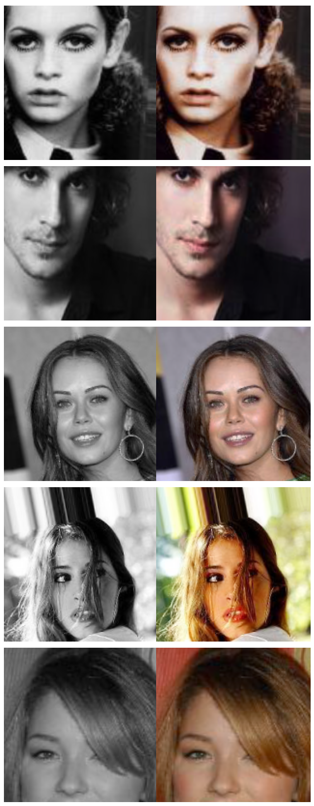
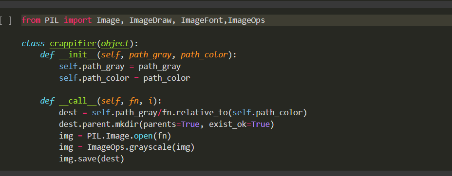
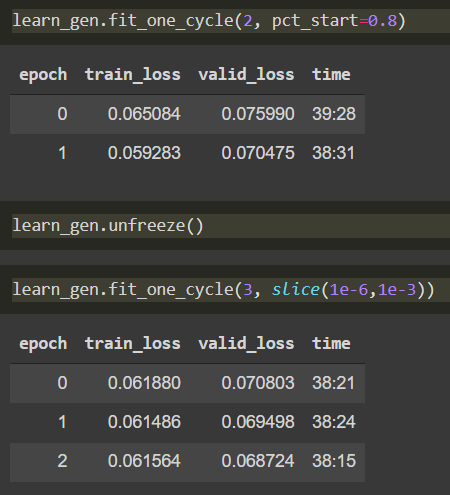
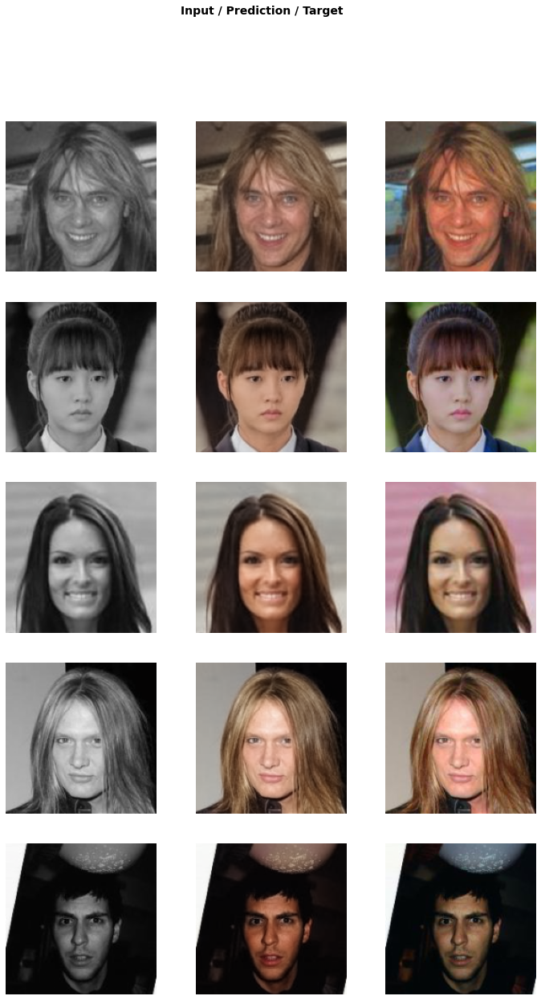
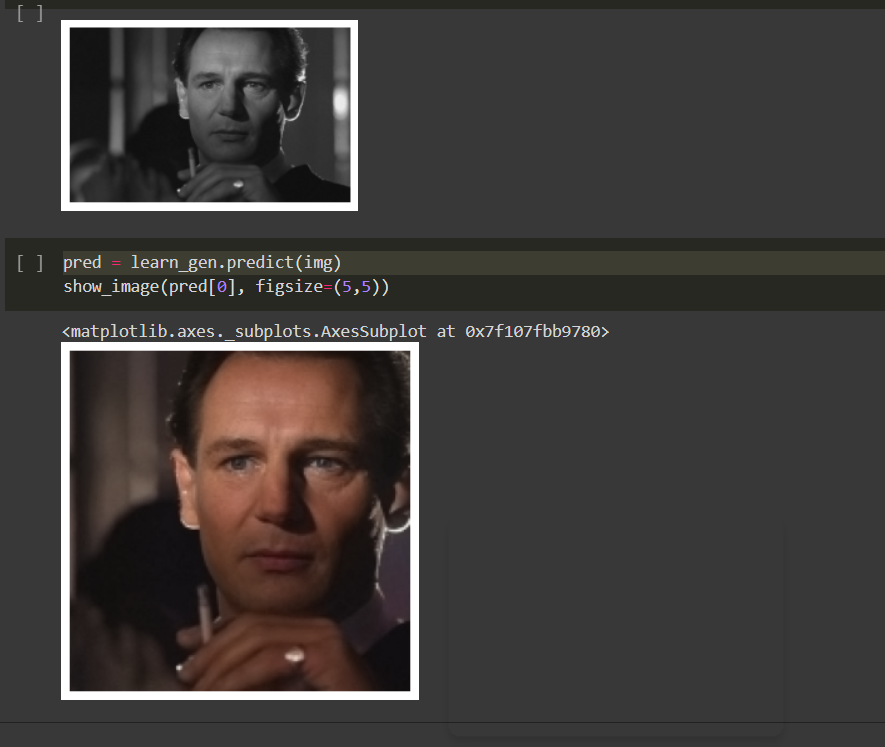

# GrayScale to Color conversion 

## Table of contents

- [The challenge](#the-challenge)
  - [Overview](#overview)
- [My process](#my-process)
  - [Built with](#built-with)
  - [Result of classifier](#result-of-classifier)
  - [Useful resources](#useful-resources)
- [Author](#author)

## The challenge

Create a program to determine the understanding of U-Net Learner, resnet34 and deep learning skills. Handson experience on Jupyter Notebook code.

### Overview

In this project, we have used U-Net learner for converting grayscale black and white images into colored ones.

## My process

- First 200k Colored Human Face images Dataset was taken from Kaggle.

- Then a new dataset of grascale images were created by converted all images into grayscale using crappifier method.

- Both dataset were trained using U-Net learner with resnet34 CNN model. The Cost funtion used was MSELossFlat().
- The training was done on Google Colab with GPU Hardware accelerator. It took around 3 hours and 20 minutes to complete the training.
- It ended up with a 6% Validation error.

- Testing on the existing data.

- You can save your model in .pkl file, which can be integrated in other webapps or mobile applications.
- Below is the link for .pkl file for trained model.
- [PKL file link](https://drive.google.com/file/d/1Unq9PFw1dG-_VThcLOg-PA4ecVyqhn4j/view?usp=sharing)

### Built with

- Python 3
- pandas
- fastai

### Result of classifier

### Useful resources

- [CelebFaces Attributes (CelebA) Dataset](https://www.kaggle.com/jessicali9530/celeba-dataset) 
- [Fastai Documentation](https://docs.fast.ai/) - This helped me for understanding all concepts of fastai library. This is the top of my list for machine learning development.

## Author

- [Abhinav Shukla](Programmer,TCS,Pune)